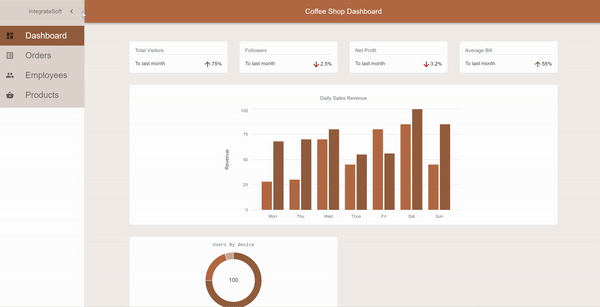

# Coffee Shop Dashboard Layout template

Starter code with the implementation of:

Basic layout: header, the main content area with drawer sidebar, footer

Navigation between pages




## Features

- React v18
- Javascript ES-6
- Material UI v2.8
- Material Icon
- React Router v6
- React Context
- React Hooks
- Responsive
- Create-react-app under the hood

## Quick Start

1. Get the latest version

```shell
git clone https://github.com/Kaddyp/coffee-shop-dashboard.git coffee-shop-dashboard
cd coffee-shop-dashboard
```

2. Run

```shell
npm install
```

3. Run

```shell
npm start
```

4. Open [http://localhost:3000](http://localhost:3000) to view it in the browser.
